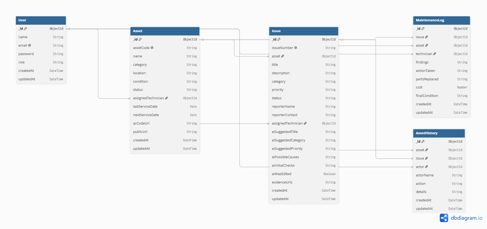

<div align="center">

# 🛠️ MaintainIQ

### AI-Powered QR Maintenance & Asset History Platform

**Track A — Advanced Full-Stack + GenAI Submission**
SMIT Final Hackathon

[](https://smit-final-hackathon-gamma.vercel.app/login)
[](https://smit-final-hackathon-backend-nu.vercel.app/)
[](#license)

[](#)
[](#)
[](#)
[](#)
[](#)
[](#)
[](#)

</div>

---

## 📖 Overview

**Maintainiq** is a full-stack, AI-assisted asset maintenance system built around **QR codes**. Every physical asset (machine, appliance, equipment) gets a unique QR code — scanning it opens a public page where anyone can report an issue in plain language. An **OpenAI-powered triage engine** instantly classifies the complaint (title, category, priority, likely causes, safety checks), and the issue flows through a **strict, backend-enforced state machine**: `Reported → Under Inspection → Under Maintenance → Operational`, with a complete, auditable history preserved per asset.

Built end-to-end — auth, role-based access, AI integration, and a production deployment — within an **8-hour hackathon window**.

**🔗 Live App:** [smit-final-hackathon-gamma.vercel.app](https://smit-final-hackathon-gamma.vercel.app/login)
**🔗 Backend API:** [smit-final-hackathon-backend-nu.vercel.app](https://smit-final-hackathon-backend-nu.vercel.app/)
**🔗 Repository:** [github.com/AhmedDevx07/SMIT-Final-Hackathon](https://github.com/AhmedDevx07/SMIT-Final-Hackathon)

---

## ✨ Key Features

| Feature | Description |
|---|---|
| 🔳 **QR-Based Asset Tracking** | Every asset gets an auto-generated unique code + QR image on creation |
| 🌐 **Public Reporting, No Login** | Anyone who scans a QR can view safe asset info and report an issue |
| 🤖 **AI Issue Triage** | OpenAI suggests title, category, priority, probable causes & safe checks from a free-text complaint |
| ✅ **Human-in-the-loop** | Users review and edit the AI's suggestion before it's ever submitted |
| 🔁 **Enforced State Machine** | Issue status can only move through valid, predefined transitions |
| 🧑‍🔧 **Role-Based Dashboards** | Separate, permission-scoped views for Admin and Technician |
| 📜 **Full Asset History** | Every status change and maintenance action is logged and timeline-viewable |
| 🎨 **Modern & Responsive UI** | Premium Midnight Blue & Indigo aesthetic built with Tailwind CSS |
| 🔐 **Secured by the Backend** | Business rules are enforced in controllers/middleware, not just hidden in the UI |

---

## 🧰 Tech Stack

**Backend**
- Node.js & Express
- MongoDB with Mongoose
- JWT Authentication
- OpenAI API (AI Issue Triage)
- `qrcode` (QR generation)

**Frontend**
- React (Vite)
- Tailwind CSS
- Redux Toolkit
- React Router
- Framer Motion (animations)
- Axios

---

## 🖥️ Core Workflow

```
1. Admin registers an asset
       → unique asset code + QR code auto-generated

2. Public user scans the QR / opens the link
       → lands on a safe public asset page (no login required)

3. User describes the complaint
       → AI Issue Triage suggests title, category, priority, causes & safe checks

4. User reviews / edits the AI suggestion
       → then submits the issue

5. Issue lands on the Admin dashboard
       → gets assigned to a technician

6. Technician works the issue
       → Inspection → Maintenance → adds a maintenance note (required) → Resolved

7. Asset status cascades automatically
       → Issue Reported → Under Inspection → Under Maintenance → Operational

8. Full history timeline
       → preserved and viewable per asset, end to end
```

---

## 🔐 Security & Business Rules

These rules are enforced **in the backend**, not just hidden away in the UI:

- ✅ JWT auth + role-based `authorize()` middleware on every admin/technician route
- ✅ Public routes (`/api/assets/public/:assetCode`, `/api/issues/public`) return only safe fields — no internal notes, costs, or user data ever leak
- ✅ Issue transitions follow a strict state machine (`VALID_ISSUE_TRANSITIONS` in `issueController.js`) — invalid jumps are rejected with a clear error
- ✅ An issue **cannot** be marked Resolved without an existing maintenance log
- ✅ Maintenance cost can't be negative; next service date can't precede the last service date
- ✅ Asset codes and QR mappings are **immutable** once created — editing name/location never breaks the QR link
- ✅ OpenAI API key lives only in the backend `.env` — never exposed to the frontend
- ✅ AI Triage has a graceful fallback — a timeout, missing key, or parse failure never blocks the workflow

---

## 🗄️ Database Schema



Entity-relationship diagram covering `User`, `Asset`, `Issue`, `MaintenanceLog`, and `AssetHistory`, including all foreign-key relationships (e.g. `Issue.asset → Asset._id`, `MaintenanceLog.issue → Issue._id`).

---

## 📮 API Documentation (Postman)

A full Postman collection is included, covering every endpoint (Auth, Assets, Issues, Maintenance, AI Triage), with pre-configured environment variables and auto-chaining test scripts — logging in automatically sets the auth token, and creating an asset or issue automatically sets its ID for the next request.

**Import it:** [`backend/postman/MaintainIQ.postman_collection.json`](./backend/postman/MaintainIQ.postman_collection.json)

1. Open Postman → **Import** → select the file above
2. Set the `baseUrl` collection variable to the deployed backend URL (or `http://localhost:5000` for local dev)
3. Run **Auth → Login User** first — the token is captured automatically for all subsequent requests
4. Run **Assets → Create Asset**, then **Issues → Report Issue (Public)** — their IDs chain automatically into the rest of the collection

---

## 🚀 Getting Started

### Prerequisites
- Node.js (v18+ recommended)
- MongoDB (local or Atlas)
- An OpenAI API key

### 1. Clone the repository
```bash
git clone https://github.com/AhmedDevx07/SMIT-Final-Hackathon.git
cd SMIT-Final-Hackathon
```

### 2. Backend setup
```bash
cd backend
npm install
cp .env.example .env    # fill in MONGO_URI, JWT_SECRET, OPENAI_API_KEY
npm run seed             # creates demo admin/technician + 3 demo assets
npm run dev               # starts on http://localhost:5000
```

### 3. Frontend setup
```bash
cd frontend
npm install
npm run dev               # starts on http://localhost:5173
```

---

## 🔑 Demo Credentials

Try the [live app](https://smit-final-hackathon-gamma.vercel.app/login) instantly with these seeded accounts:

| Role | Email | Password |
|---|---|---|
| 👑 Admin | `admin@maintainiq.com` | `Admin123!` |
| 🔧 Technician | `Ali@maintainiq.com` | `tech123` |

---

## 📁 Folder Structure

```
backend/
├── api/            → Vercel serverless entry point
├── config/         → DB connection
├── controllers/     → business logic per module
├── docs/            → database-schema.png (ER diagram)
├── middleware/      → JWT auth, role guard, error handler
├── models/          → User, Asset, Issue, MaintenanceLog, AssetHistory
├── postman/          → MaintainIQ.postman_collection.json (full API collection)
├── routes/           → Express routers
├── utils/            → asset code / issue number generators, QR generator, history logger
├── seeder.js         → demo data
└── server.js         → entry point

frontend/
└── src/
    ├── pages/       → Login, AdminDashboard, TechnicianDashboard, PublicAssetPage, AssetDetails
    ├── components/  → assets/, issues/, maintenance/, layout/
    ├── redux/       → auth, assets, issues slices
    ├── services/    → axios instance
    └── routes/      → PrivateRoute guard
```

---

## 🗺️ Roadmap / Scoped Out

Due to the 8-hour hackathon time limit, the following were intentionally scoped out — the core end-to-end workflow above is fully functional without them:

- 🖼️ Evidence/image upload via Cloudinary
- ☁️ AWS integration
- 🐳 Docker containerization
- ⚙️ GitHub Actions CI/CD
- ⚡ Redis caching
- 📧 Email notifications
- 🚦 Rate limiting

---

## 👤 Author

**Muhammad Ahmed** — [@AhmedDevx07](https://github.com/AhmedDevx07)

---

## 📄 License

This project was built for the **SMIT Final Hackathon** (Track A: Advanced Full-Stack + GenAI).

<div align="center">

⭐ **If you found this project interesting, consider giving it a star!** ⭐

</div>